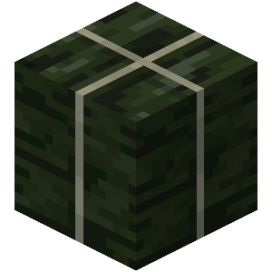

  
  <h1 align="center">TAKANA³</h1>

[中文版本](./README.md)

## 📖 About The Project

TAKANA³ is a feature-rich visual editor designed to provide a seamless creation experience for TAKUMI³ style charts.

## 🚀 Getting Started

- **User Manual**: Please refer to the [TAKANA³ 使用说明书](https://blog.senolytics.top/2025/01/28/takana-cubic-instruction/) for up-to-date documentation and tutorials.

- **Troubleshooting**: For guidance on locating log files, please check the manual.

## 🐞 Bug Reports & Suggestions

If you encounter any issues or have suggestions for improvement:

- Open a [GitHub Issue](https://github.com/Selakz/TAKANA_Cubic/issues).

- **For Bug Reports**: Please provide a clear description of the issue, steps to reproduce it, and attach the relevant log files.

## 🛠️ Contributing

If you are interested in developing this project, feel free to reach out to me. Besides, direct [Pull Requests](https://github.com/Selakz/TAKANA_Cubic/pulls) are always welcome! Your help is vital to the perfection of this project.

## 🏗️ Technical Architecture

The project is divided into three main assemblies with a strict dependency flow:

- **App**: Contains codes which are independent of the app's specific functions.

- **MusicGame**: Contains all logic related to the chart editor. The `ChartEditor` module depends on other internal parts.

- **T3Framework**: A general-purpose framework developed during this project:

  - `Preset`: High-reusability components oriented towards specific business needs (e.g., UI components).

  - `Runtime`: Unity-based framework foundation for extending specific scripts.

  - `Static`: Pure C# framework code, independent of the Unity engine.

## 📜 Copyright

© Senolytics 2026. All rights reserved.

If you believe that any content on this project violates your copyright, please contact me at <senolytics@foxmail.com>. I will address your concerns promptly.

## ❤️ Credits

Special thanks to these projects for their inspiration and technical contributions:

- [yojohanshinwataikei / Arcade-plus](https://github.com/yojohanshinwataikei/Arcade-plus)
- [Arcthesia / ArcCreate](https://github.com/Arcthesia/ArcCreate)
- [Chlorie / Deenote](https://github.com/Chlorie/Deenote)
- [yasirkula / UnityDynamicPanels](https://github.com/yasirkula/UnityDynamicPanels)
- [gkngkc / UnityStandaloneFileBrowser](https://github.com/gkngkc/UnityStandaloneFileBrowser)
- [Cysharp / UniTask](https://github.com/Cysharp/UniTask)
- [GlitchEnzo / NuGetForUnity](https://github.com/GlitchEnzo/NuGetForUnity)
- [Demigiant / dotween](https://github.com/Demigiant/dotween)
- [hadashiA / VContainer](https://github.com/hadashiA/VContainer)

Below are some sources of the project's resources：

- Icons mainly from [Flaticon](https://www.flaticon.com)
- Background music source of app entry: Amethyst Cove / KhantLOL from B.M.P.O.A.T. Original SoundTrack
